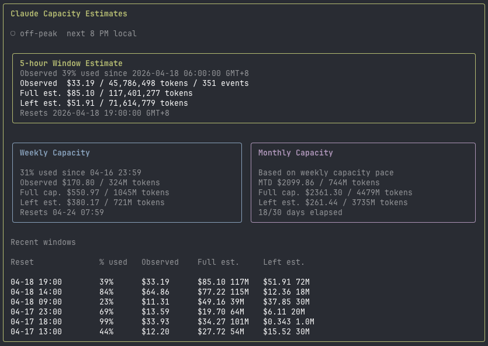

# claude-cost

Minimal Bun CLI for tracking local AI coding assistant usage and estimating cost from model pricing when local token data is available.

<p align="center">
  
</p>

<p align="center">
  Terminal dashboard for local Claude Code, Codex, and Cursor usage with cost and capacity estimates.
</p>

## Install

```bash
bun install -g claude-cost   # global CLI on $PATH
# or
npx claude-cost dashboard    # one-shot
```

Pre-built binaries (no Bun required) are published per release for darwin-arm64,
darwin-x64, linux-x64, linux-arm64, and windows-x64. See the
[Releases page](https://github.com/iceinvein/token-usage-cost/releases).

## Commands

From a clone:

```bash
bun install
bun run sync                 # ingest claude/codex/cursor into SQLite
bun run today
bun run week
bun run month
bun run daily   -- --from 2026-04-08 --to 2026-04-14
bun run models  -- --from 2026-04-08 --to 2026-04-14
bun run dashboard
bun run projects -- --from 2026-04-01 --to 2026-04-14
bun run export   -- --type daily --format csv --out /tmp/claude-cost-daily.csv
```

Or via the installed binary:

```bash
claude-cost sync
claude-cost dashboard --source claude-code
claude-cost today --sync --root ~/.claude/projects --date 2026-04-14
```

## Dashboard

- `bun run dashboard` (or `claude-cost dashboard`) starts the interactive dashboard with automatic refresh enabled.
- The dashboard syncs Claude/Codex usage before each refresh by default.
- Cursor activity is also included during sync.
- Use `--no-watch` to disable automatic refresh.
- Use `--no-sync` to read only what is already stored in SQLite.
- Use `--source claude-code`, `--source codex-cli`, or `--source cursor` to filter the dashboard to a single tool.
- The `Sources` panel is only shown when `--source all` is active.
- Standard dashboard data refreshes every 10 seconds by default, or whatever you pass with `--interval`.
- The Claude-only `Claude Usage` panel reads live `/usage` data from the local Claude CLI.
- Claude usage snapshots are cached in `~/.local/share/claude-cost/claude-usage.json`.
- The dashboard shows the last saved Claude usage snapshot immediately on startup, then refreshes it in the background only when it is stale.
- Claude `/usage` checks are throttled to every 5 minutes by default and manual `r` refresh still forces an immediate check.

## What it does

- Reads local Claude Code transcripts, Codex usage data, and Cursor workspace activity
- Extracts actual token usage from assistant entries
- Persists normalized usage events in SQLite
- Persists Claude `/usage` snapshots separately for fast dashboard startup
- Fetches model pricing from LiteLLM and caches it locally
- Calculates estimated USD cost from usage plus pricing
- Flags unknown model names instead of hiding them
- Auto-refreshes the dashboard every 10 seconds by default
- Syncs Claude/Codex/Cursor usage before each dashboard refresh by default
- Supports filtering the dashboard to a single tool
- Shows Claude 5-hour and weekly usage left when the local Claude CLI exposes `/usage`

## Team aggregation (optional)

Ship Claude Code events to Grafana Loki for team-wide dashboards. Configure via
`.env.local`:

```bash
LOKI_URL=https://logs-prod-XXX.grafana.net
LOKI_USERNAME=...
LOKI_PASSWORD=...           # or LOKI_TOKEN
LOKI_TEAM=my-team           # label
LOKI_MAX_AGE_HOURS=168      # only push events newer than this (default 7d)
```

Then:

```bash
bun run loki:test           # verify auth + reachability
bun run loki:push           # batched push of unsynced events (claude-code only)
bun run loki:delete         # list / cancel Loki delete requests
bun run loki:reset          # clear synced_at flags after retention skips
```

A starter Grafana dashboard lives at `grafana/claude-cost-overview.json`.

## Notes

- Token counts come from local transcript logs.
- USD totals are estimates, not billing API results.
- Claude usage-left data comes from automating the local Claude CLI `/usage` screen, not from a billing API.
- Cursor currently contributes activity/session counts and timestamps, but not priced token usage, because Cursor does not appear to expose reliable local token accounting in the inspected on-disk data.
